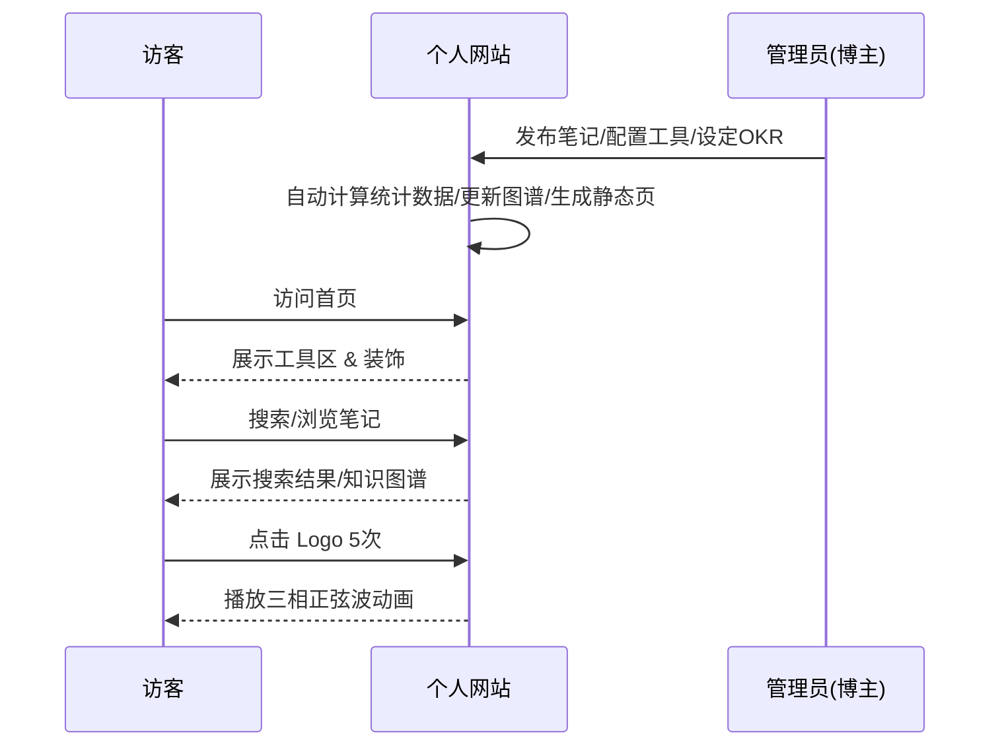

# 个人网站产品需求文档 (PRD) v2.0

## 1. 产品概述
本产品为一个集成了搜索、工具、笔记、社交及个人成长追踪功能的个人网站平台。旨在打造一个"长期主义"的个人知识基地，兼顾对外展示与对内自我管理。

## 2. 用户角色
- **访客**：浏览公开内容（笔记、工具、碎碎念），点赞/收藏工具，评论碎碎念。
- **管理员（博主）**：拥有全站最高权限，包括内容发布、数据查看、目标管理、系统配置等。

## 3. 功能模块详情

### 3.1 搜索引擎区
- **用户故事**：作为用户，我希望在一个入口快速切换常用或垂直搜索引擎，以便提高检索效率。
- **验收标准**：
    1.  支持 Google, Bing, Baidu 及垂直引擎（知网, GitHub, StackOverflow）。
    2.  支持通过 `search_engines.yaml` 配置文件热更新引擎列表。
    3.  下拉/标签页切换流畅，回车直接跳转。
- **数据指标**：搜索引擎使用频次分布。

### 3.2 工具区 (首页核心)
- **用户故事**：作为访客，我希望能直接使用便捷的小工具解决具体问题；作为博主，我希望方便地扩展新工具。
- **验收标准**：
    1.  **进制转换器**：支持 2/8/10/16 进制互转。
    2.  **图片转换器**：支持 JPG/PNG/WEBP 互转及压缩。
    3.  **插件化架构**：所有工具需实现 `ITool` 接口，新增工具无需修改核心代码。
    4.  **交互**：卡片式展示，支持点赞和"收藏"（本地浏览器缓存记录）。
- **数据指标**：工具 UV（独立访客数）、点赞数 Top3、被收藏次数。

### 3.3 笔记区
- **用户故事**：作为博主，我希望通过双向链接构建知识图谱，并能直观看到知识间的关联；作为访客，我希望能通过可视化图谱探索相关知识点。
- **验收标准**：
    1.  **基础格式**：Markdown, LaTeX (MathJax/KaTeX), PDF 在线预览。
    2.  **双向链接**：支持 `[[关键词]]` 语法，自动解析为内部链接。
    3.  **知识图谱**：
        - 前端使用 D3.js 力导向图展示笔记节点关系。
        - 鼠标悬停节点显示笔记摘要。
    4.  **孤立页检测**：后台脚本定期检测，确保知识体系连通率 ≥ 80%。
- **数据指标**：笔记字数、代码块数、LaTeX 公式数、知识图谱连通率。

### 3.4 碎碎念区 (Mutter)
- **用户故事**：作为博主，我希望发布碎片化想法并能看到关键词云；作为访客，我希望能在移动端流畅浏览并评论。
- **验收标准**：
    1.  **内容**：支持图文混排，时间轴倒序展示。
    2.  **互动**：简单的评论功能（防垃圾机制）。
    3.  **词云**：基于 Jieba 分词统计高频词，生成可视化词云。
- **数据指标**：关键词频率 Top10。

### 3.5 成长追踪区 (Dashboard) [管理员独享]
- **用户故事**：作为博主，我希望看到自己每日/每月的知识输入输出曲线和OKR进度，以缓解成长焦虑。
- **验收标准**：
    1.  **数据自动抓取**：自动统计笔记字数、代码量、公式数、工具区互动数据。
    2.  **可视化报表**：
        - **折线图**：每月"新增知识点" vs "复习次数"（基于 Git 提交或访问日志）。
        - **雷达图**：专业能力维度（电力电子 / 控制理论 / 嵌入式 / 数据科学 / 英语）。
    3.  **目标管理**：
        - 设置季度 OKR（如：Q2 通过注册电气工程师基础考试）。
        - 进度条展示当前完成度。
    4.  **消息提醒**：集成 Server 酱，支持邮件/微信模板消息推送。

## 4. 界面与交互 (UI/UX)
- **视觉风格**：
    - **浅色模式**：浅绿色主调 (#e8f5e9)，清新自然。
    - **深色模式**：深蓝夜间色 (#0d1b2a, #1b263b, #415a77)，减少视疲劳，支持系统自动切换或手动切换。
- **彩蛋设计**：
    - 鼠标连续点击 Logo 5 次，背景播放"三相正弦波"动画。
- **布局策略**：
    - 首页工具区优先，注重工具的查找与交互效率。
    - 装饰区域预留，保持界面美观不单调。

## 5. 非功能需求

### 5.1 可持续运营
| 项目 | 具体做法 | 预期收益 |
| :--- | :--- | :--- |
| **SEO** | 每篇笔记自动生成 Description、OG 图，URL 语义化（/notes/relay-protection/） | 6 个月后搜索"继电保护笔记"进入前 30 名 |
| **备份** | 每日 Git 自动 push 到 GitHub 私有库 + 阿里云 OSS 镜像 | 即使服务器故障，5 分钟内可恢复数据 |
| **更新节奏** | 每周至少 1 篇笔记 + 1 次代码提交，Dashboard 展示"连续提交天数" | 形成正反馈，方便面试展示"长期主义"特质 |
| **开源贡献** | 将通用工具抽离为独立 Repo，编写英文 README，提供 Issue 模板 | 提高 GitHub 活跃度，利于海外申请或求职 |

### 5.2 插件化接口
- **前端**：工具组件需实现 `ITool` 接口 `{ name, desc, component, defaultWidth, defaultHeight }`。
- **后端**：搜索引擎配置使用 `search_engines.yaml`，新增只需配置 `{ name, icon, templateUrl, isActive }`。

## 附录：用户交互流程 (简易泳道图)

